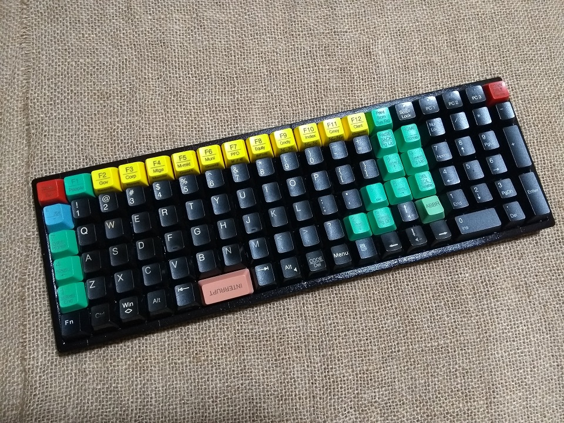
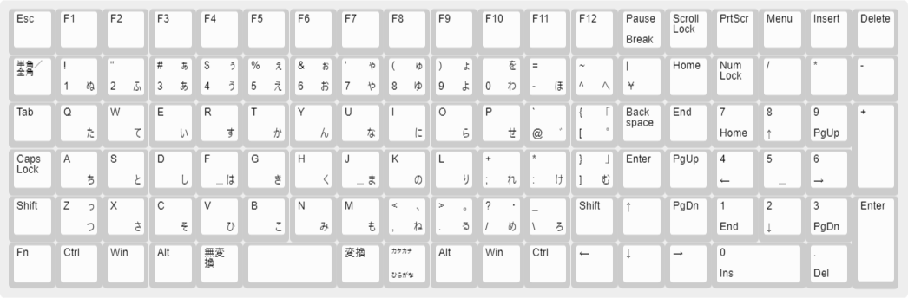

# Hyaku

A 3D-printable 6x19 ortholinear JIS-layout keyboard.

## Notes

The glamour shot shown above is using temporary keycaps only. I am also currently waiting for a 3mm clear acrylic bottom plate to be manufactured.

Print the halves with the top face down, and with supports.

Fit together and glue with CA glue.

## Materials used

- [STM32 black pill](https://stm32-base.org/boards/STM32F103C8T6-Black-Pill.html)
- [USB C breakout board](https://tronixlabs.com.au/breakout-boards/usb/usb-c-3-1-socket-breakout-board-australia/)
- [Tiny OTG adapter](https://www.adafruit.com/product/2910)
- 8× M2×12 button head screws
- 3mm clear acrylic bottom plate
- Clear adhesive rubber feet

## Blog post

TBD